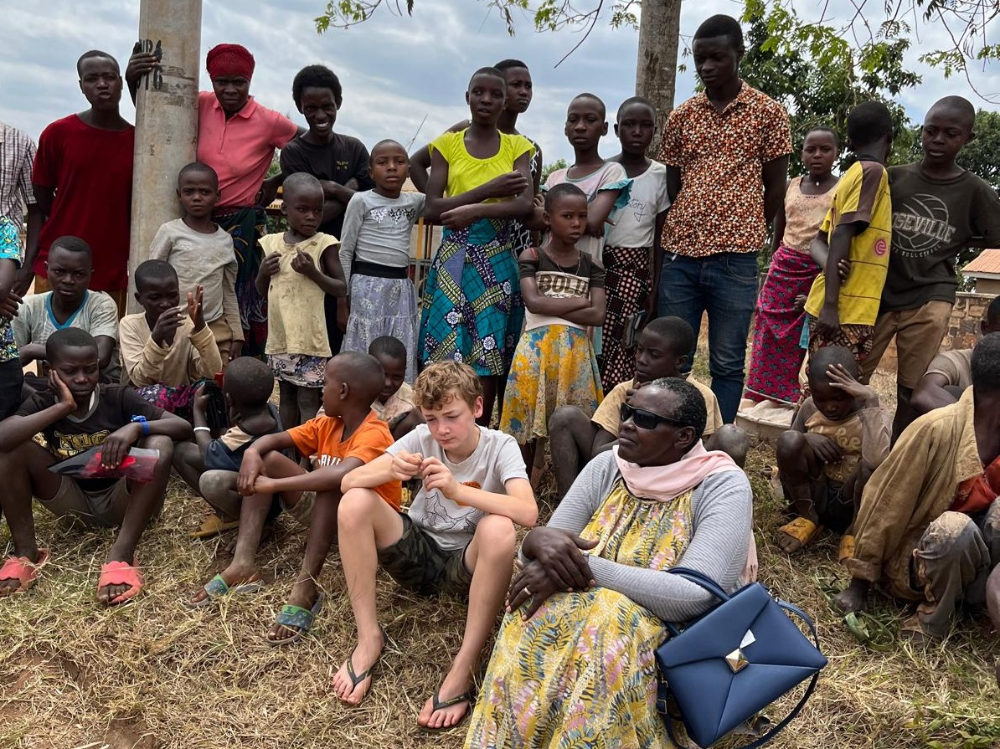

---
# Feel free to add content and custom Front Matter to this file.
# To modify the layout, see https://jekyllrb.com/docs/themes/#overriding-theme-defaults

layout: home
order: 0
---

<picture style = "position: absolute; z-index: -1;max-width: 70%">
    
</picture>